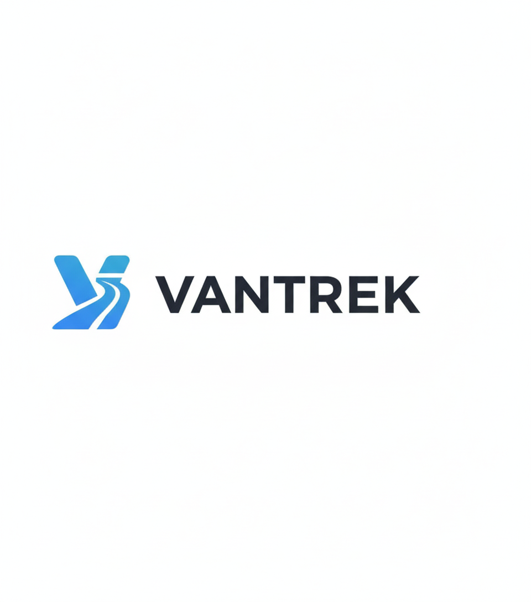
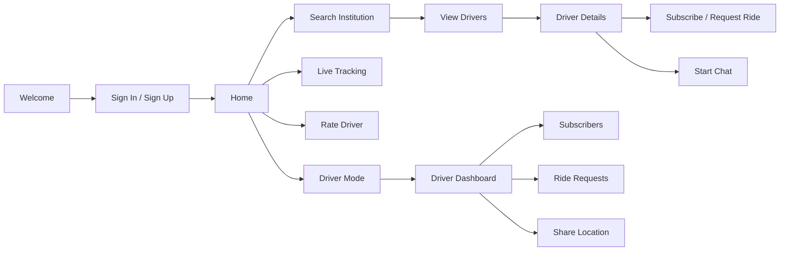

<div align="center">
  
</div>

<div align="center">
  
</div>

<div align="center">
  
</div>

<p align="center">
  
  
  
  
  
</p>

<p align="center">
  
  
  
</p>

---

## ✨ Project Snapshot

**Vantrek Rides** is a Flutter-based smart commute platform built for institution-centered transportation. It helps passengers discover trusted van/shuttle drivers, subscribe to drivers, request rides, track live locations, chat in real time, and rate their ride experience.

It is designed around a simple idea: make daily student and institution transport easier to find, easier to trust, and easier to follow.

<div align="center">
  <table>
    <tr>
      <td align="center"><strong>Passenger Experience</strong></td>
      <td align="center"><strong>Driver Experience</strong></td>
    </tr>
    <tr>
      <td></td>
      <td></td>
    </tr>
  </table>
</div>

---

## 🚀 What Vantrek Rides Does

<table>
  <tr>
    <td><strong>🔎 Driver Discovery</strong></td>
    <td>Search institutions and find available drivers connected to specific schools, colleges, or campuses.</td>
  </tr>
  <tr>
    <td><strong>📍 Live Tracking</strong></td>
    <td>Drivers can share their current location while passengers follow updates through map-powered tracking flows.</td>
  </tr>
  <tr>
    <td><strong>💬 In-App Chat</strong></td>
    <td>Passengers and drivers can create chat threads, send messages, and manage unread counts in Firebase.</td>
  </tr>
  <tr>
    <td><strong>🧾 Subscriptions</strong></td>
    <td>Passengers can subscribe to drivers for recurring commute relationships and easy access.</td>
  </tr>
  <tr>
    <td><strong>🙋 Ride Requests</strong></td>
    <td>Users can request rides while drivers manage passenger interest through dedicated driver screens.</td>
  </tr>
  <tr>
    <td><strong>⭐ Ratings</strong></td>
    <td>Passengers can rate drivers and leave feedback to improve trust and service quality.</td>
  </tr>
  <tr>
    <td><strong>🚐 Driver Mode</strong></td>
    <td>Approved drivers get a dashboard for subscribers, ride requests, ratings, profile details, and location sharing.</td>
  </tr>
</table>

---

## 🧭 App Flow



---

## 🛠️ Tech Stack

<div align="center">
  
</div>

| Layer | Technology |
| --- | --- |
| App Framework | Flutter |
| Language | Dart |
| State Management | Flutter Riverpod |
| Authentication | Firebase Auth, Google Sign-In |
| Database | Cloud Firestore |
| Realtime Data | Firebase Realtime Database, Firestore streams |
| Maps & Places | Google Maps Flutter, Google Places, Geolocator, Geocoding |
| Communication | Firebase-backed chat collections and message streams |
| Platforms | Android, iOS, Web, Linux, macOS, Windows scaffolds |

---

## 📱 Core Screens

| Passenger Side | Driver Side | Shared Flows |
| --- | --- | --- |
| Welcome screen | Become driver screen | Sign in / Sign up |
| Home dashboard | Driver dashboard | Profile |
| Institution search | Driver profile | Chat list |
| Institution details | Driver subscribers | Chat room |
| Driver details | Driver ride requests | Ratings |
| Subscribed drivers | Driver live location map | Live tracking |
| Rate driver | Driver ratings | Place details |

---

## 🧩 Project Structure

```text
lib/
├── controllers/       # Auth controller and UI-facing control logic
├── models/            # User, driver, institution, rating, chat, request models
├── providers/         # Riverpod providers for app state and services
├── repositories/      # Firebase auth repository
├── screens/           # Passenger, driver, auth, chat, map, and profile screens
├── services/          # Chat, location, institution, rating, request, subscription services
├── utils/             # Constants and validators
├── widgets/           # Reusable dialogs and UI pieces
├── firebase_options.dart
└── main.dart
```

---

## ⚡ Feature Highlights

### 🔐 Authentication

Firebase-powered sign up, sign in, Google auth support, auth-state routing, and protected access to the main app experience.

### 🏫 Institution-Based Discovery

Passengers search for institutions, explore available transport options, and reach driver detail pages from a focused discovery flow.

### 🗺️ Live Driver Location

Drivers can start and stop live location sharing. The app updates Firestore with coordinates, heading, speed, online status, and timestamps.

### 💬 Realtime Chat

Chat threads are created per passenger-driver pair. Messages are stored under chat subcollections with unread counters for both sides.

### 🚐 Driver Dashboard

Drivers can manage profile visibility, subscribers, ride requests, ratings, and live location from a dedicated driver mode.

---

## 🧪 Getting Started

### Prerequisites

```bash
Flutter SDK
Dart SDK
Firebase project
Google Maps API key
Android Studio or VS Code
```

### Installation

```bash
git clone https://github.com/diyansyed/vantrek_rides.git
cd vantrek_rides
flutter pub get
```

### Firebase Setup

1. Create a Firebase project.
2. Enable Firebase Authentication.
3. Enable Cloud Firestore.
4. Enable Firebase Realtime Database if using realtime location/chat extensions.
5. Add Android/iOS/web apps in Firebase.
6. Generate `firebase_options.dart` with FlutterFire CLI.

```bash
dart pub global activate flutterfire_cli
flutterfire configure
```

### Maps Setup

Add your Google Maps API key to the native platform files and enable:

```text
Maps SDK for Android
Maps SDK for iOS
Places API
Geocoding API
```

### Run

```bash
flutter run
```

---

## 🔥 Why It Stands Out

<div align="center">

| 🌟 Strength | 💎 Why It Matters |
| --- | --- |
| Real product flow | Not just UI screens; it includes auth, data, users, drivers, requests, ratings, chat, and tracking. |
| Multi-role experience | Passengers and drivers have separate responsibilities and purpose-built screens. |
| Firebase-backed architecture | Auth, Firestore streams, realtime updates, and structured service classes power the app. |
| Map-first commute utility | Google Maps, Places, geolocation, and live driver status support practical transport use cases. |
| Clean Flutter organization | Models, services, providers, repositories, screens, and widgets are separated clearly. |

</div>

---

## 🗺️ Roadmap

- [ ] Admin approval panel for driver applications
- [ ] Push notifications for ride requests and chat messages
- [ ] Route preview and estimated arrival time
- [ ] Payment or subscription billing flow
- [ ] Ride history and saved commute routes
- [ ] Driver verification documents
- [ ] Production Firestore security rules
- [ ] CI workflow for automated Flutter checks

---

## 🤝 Contributing

Contributions are welcome. A good contribution keeps the app focused on reliable commute discovery, driver trust, realtime communication, and clean Flutter architecture.

```bash
git checkout -b feature/your-feature
flutter analyze
flutter test
git commit -m "Add your feature"
```

---

## 📸 Gallery

<div align="center">
  
  <br />
  <br />
  
  &nbsp;&nbsp;
  
</div>

---

## 💙 Built For Better Commutes

<div align="center">
  <h3>Vantrek Rides turns scattered transport discovery into a connected, trackable, and trusted ride experience.</h3>
  
</div>
