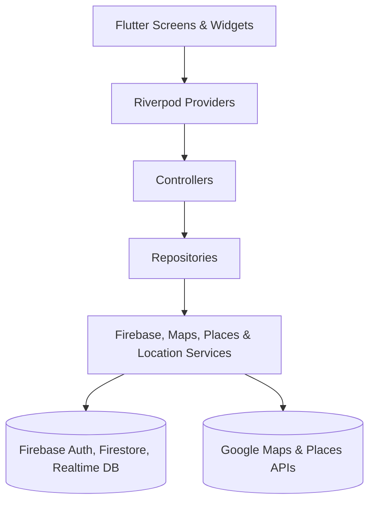
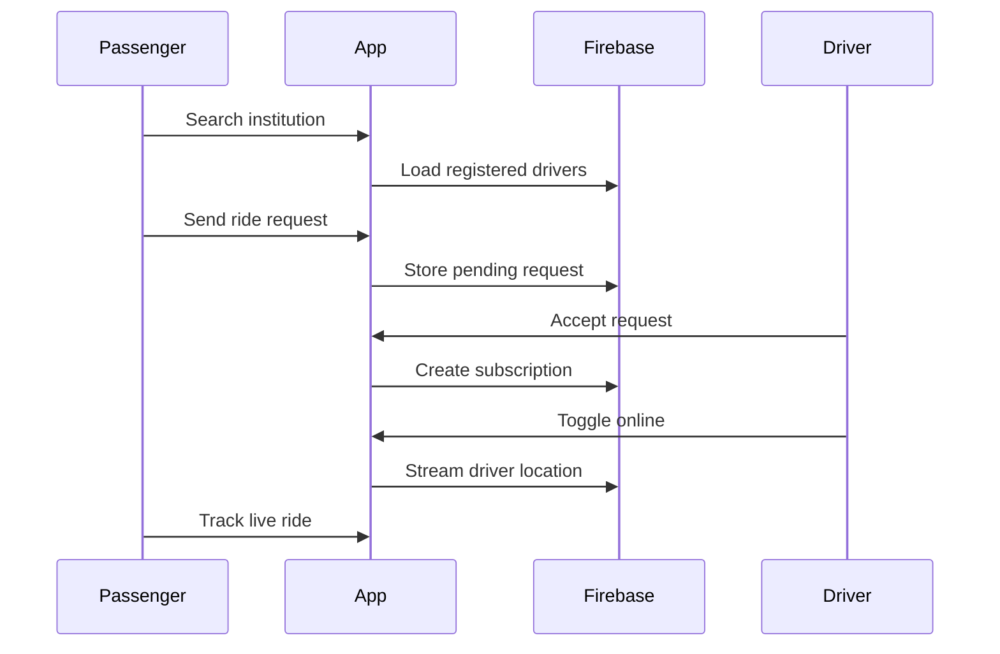

<div align="center">
  

  # Vantrek Rides

  **A modern Flutter commute platform connecting students, institutions, and trusted van drivers.**

  <p>
    Find institution-based rides, subscribe to drivers, chat in-app, track live locations, and manage driver operations from one clean mobile experience.
  </p>

  <p>
    
    
    
    
    
  </p>
</div>

---

## ✨ App Preview

<div align="center">
  <table>
    <tr>
      <td align="center"><strong>Home & Discovery</strong></td>
      <td align="center"><strong>Driver & Ride Flow</strong></td>
    </tr>
    <tr>
      <td></td>
      <td></td>
    </tr>
  </table>
</div>

## 🚀 What Is Vantrek Rides?

Vantrek Rides is a Flutter mobile application built for institution-centered transport. It helps passengers discover trusted van or shuttle drivers, request rides, manage subscriptions, follow driver locations in real time, and communicate directly inside the app.

For drivers, Vantrek provides a dedicated dashboard to manage online status, institutions, routes, pickup times, ride requests, subscribers, ratings, and profile details.

## 🌟 Highlights

| Passenger Experience | Driver Experience | Platform Experience |
| --- | --- | --- |
| 🔐 Email/password authentication | 🧾 Driver registration flow | ⚡ Flutter + Material 3 |
| 🏫 Institution and driver discovery | 📍 Online/offline location sharing | 🔥 Firebase Auth + Firestore |
| 🚐 Ride requests and subscriptions | 📬 Accept/reject ride requests | 🧭 Google Maps + Places |
| 🗺️ Live driver tracking | 👥 Subscriber management | 🧠 Riverpod state management |
| 💬 In-app messaging | ⭐ Ratings visibility | 📱 Android-first mobile flow |
| ⭐ Driver ratings and reviews | 🛣️ Route and pickup time setup | 🧩 Clean feature-based folders |

## 🧭 Core Features

### 👤 For Passengers

- **Smart driver discovery**: Search institutions and browse registered drivers with route and rating details.
- **Ride requests**: Send subscription or ride requests directly to selected drivers.
- **Live tracking**: Track subscribed drivers on an interactive Google Map.
- **Messaging**: Chat with drivers inside the app.
- **Ratings and reviews**: Rate completed driver experiences to improve trust and quality.
- **Profile management**: Manage user information and access passenger tools from the home flow.

### 🚐 For Drivers

- **Driver application flow**: Apply to become a registered driver.
- **Driver dashboard**: View subscriber count, rating, pending ride requests, and quick actions.
- **Online status toggle**: Start or stop real-time location sharing for subscribers.
- **Institution registration**: Add service institutions and manage driver visibility.
- **Route setup**: Define pickup/drop-off routes and pickup times.
- **Request management**: Accept or reject passenger ride requests.
- **Subscriber management**: View subscribed passengers and keep communication open.

## 🧱 Tech Stack

| Layer | Tools |
| --- | --- |
| App Framework | Flutter, Dart |
| UI | Material 3, custom Flutter widgets |
| State Management | Flutter Riverpod |
| Authentication | Firebase Authentication, Google Sign-In package |
| Database | Cloud Firestore, Firebase Realtime Database |
| Maps & Location | Google Maps Flutter, Google Places, Geolocator, Geocoding |
| Networking & Utilities | HTTP, UUID, Intl, URL Launcher |
| Platforms | Android, iOS, Web, Windows, macOS, Linux Flutter scaffolds |

## 🏗️ Architecture



The `lib` directory is organized around clear responsibilities:

```text
lib/
├── controllers/     # Riverpod StateNotifiers and app-level business logic
├── models/          # User, driver, institution, chat, rating, subscription models
├── providers/       # Shared providers for services, drivers, places, and app state
├── repositories/    # Data access abstractions, especially authentication
├── screens/         # Passenger, driver, auth, chat, maps, and institution screens
├── services/        # Firebase, chat, ride request, subscription, location, maps services
├── utils/           # Constants, colors, validators, regex helpers
└── widgets/         # Reusable dialogs and UI building blocks
```

## 🧪 Key Workflows



## ⚙️ Getting Started

### Prerequisites

- Flutter SDK installed
- Android Studio or VS Code with Flutter tooling
- Firebase project
- Google Cloud project with Maps and Places APIs enabled
- Android emulator or physical device

### Installation

```bash
git clone https://github.com/diyansyed/vantrek_rides.git
cd vantrek_rides
flutter pub get
```

### Firebase Setup

1. Create or open a Firebase project.
2. Enable **Authentication** with email/password sign-in.
3. Enable **Cloud Firestore**.
4. Enable **Realtime Database** if using realtime location flows.
5. Configure FlutterFire:

```bash
dart pub global activate flutterfire_cli
flutterfire configure
```

6. Confirm these generated files exist for your environment:

```text
lib/firebase_options.dart
android/app/google-services.json
```

### Google Maps & Places Setup

Enable the following APIs in Google Cloud:

- Maps SDK for Android
- Places API
- Geocoding API, if address lookup is required

Then configure Android metadata in:

```text
android/app/src/main/AndroidManifest.xml
```

For production, keep API keys restricted by package name, SHA certificate, and API scope.

### Run The App

```bash
flutter run
```

## ✅ Quality Commands

```bash
flutter analyze
flutter test
dart format .
```

## 📦 Build

```bash
flutter build apk --release
flutter build appbundle --release
```

For iOS release builds, configure signing in Xcode and run:

```bash
flutter build ios --release
```

## 🔐 Security Notes

- Restrict Google Maps and Places API keys before shipping.
- Keep production Firebase rules strict and role-aware.
- Avoid committing production secrets or unrestricted API credentials.
- Validate driver approvals and subscription permissions on the backend, not only in the client UI.
- Review Firestore indexes for chat ordering, driver search, and request filtering.

## 🗺️ Roadmap Ideas

- Push notifications for ride requests and chat messages
- Admin approval dashboard for driver applications
- Trip history for passengers and drivers
- Payment integration for subscriptions
- Route preview with estimated arrival time
- Driver document verification
- Saved favorite institutions and drivers

## 🤝 Contributing

Contributions are welcome. A good contribution flow:

1. Fork the repository.
2. Create a feature branch.
3. Run `dart format .`, `flutter analyze`, and `flutter test`.
4. Open a pull request with screenshots for UI changes.

## 📄 License

No license file is currently included. Add a license before distributing or accepting external contributions.

---

<div align="center">
  <strong>Vantrek Rides</strong><br />
  Built with Flutter, Firebase, and a focus on safer everyday student transport.
</div>
